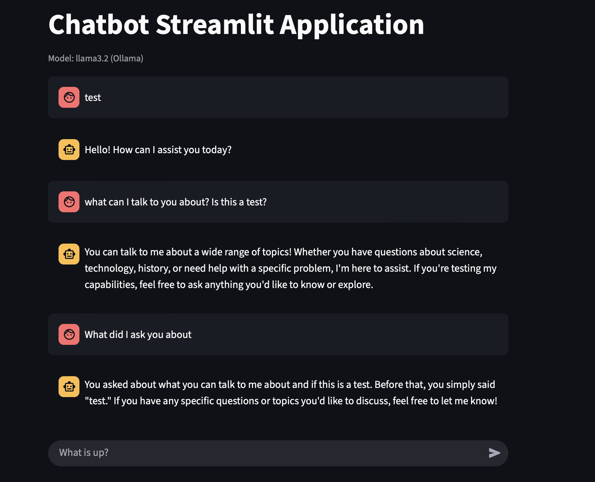

# Chatbot Basic

A Streamlit-powered chatbot application that supports both OpenAI GPT and Ollama models, with integrated Arxiv paper retrieval as a tool.

## Features

- **Conversational AI:** Chat with an assistant powered by either OpenAI GPT-4o or Ollama (Llama3.2).
- **Arxiv Paper Retrieval:** Use the `retrieve` tool to fetch and summarize academic papers from Arxiv.
- **Streaming Responses:** AI responses are streamed for a smooth chat experience.
- **Model Switching:** Subtitle displays which model is currently active.
- **LangSmith Tracing:** Optional tracing for debugging and analytics.

<p align="center">
    
    <br>
</p>

## Setup

1.**Clone the repository:**

```bash
   git clone <your-repo-url>
   cd chatbot-basic
```

2.**Install dependencies:**

```bash
   pip install -r requirements.txt
```

3.**Set environment variables:**

- Create a `.env` file in the root directory:

```python
   OPENAI_API_KEY=your-openai-key
   LANGCHAIN_API_KEY=your-langsmith-key
```

- (Optional) Set additional LangSmith tracing variables if needed.

4.**Start Ollama (if using Ollama):**

- Make sure Ollama is running locally and the desired model (e.g., `llama3.2`) is available.

## Usage

Run the Streamlit app:

```bash
streamlit run src/streamlit_app.py
```

- The app will display a chat interface.
- The subtitle will show which model is active (GPT-4o or Ollama).
- Type your questions in the chat input.
- To retrieve papers, mention your need to investigate papers in your message.

## File Structure

```bash
src/
  chatbot.py         # Chatbot logic and graph construction
  streamlit_app.py   # Streamlit UI and app entry point
```

## Customization

- **Switch models:** Change the `llm` initialization in `streamlit_app.py` to use either `ChatOpenAI` or `ChatOllama`.
- **Add tools:** Extend `chatbot.py` to add more tools or retrieval functions.

## Troubleshooting

- **Session state errors:** Always run the app with `streamlit run`, not plain `python`.
- **Model errors:** Ensure your API keys and Ollama server are set up correctly.
- **Streaming issues:** Input is disabled while the AI is generating a response to prevent interruptions.
